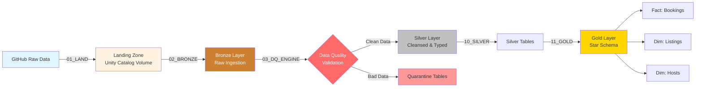
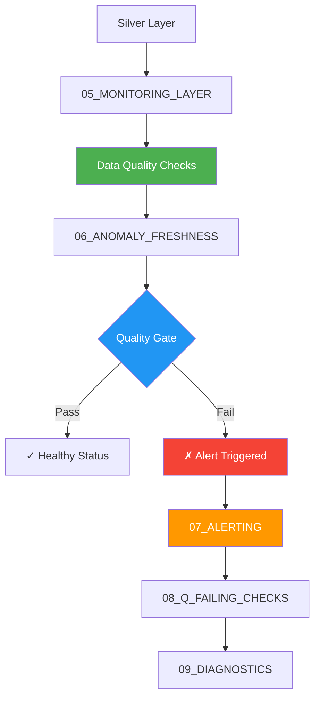
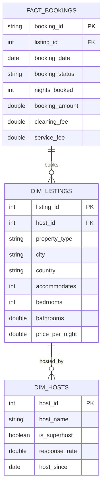

# 🏠 Databricks Airbnb Data Platform
## End-to-End Data Engineering with Medallion Architecture & Data Quality Monitoring


## 📋 Table of Contents
- [Project Overview](#project-overview)
- [Architecture](#architecture)
- [Data Model](#data-model)
- [Project Structure](#project-structure)
- [Features](#features)
- [Getting Started](#getting-started)
- [Data Quality Framework](#data-quality-framework)
- [Monitoring & Alerting](#monitoring--alerting)

---

## 🎯 Project Overview

This project demonstrates a production-grade **Medallion Architecture** implementation on Databricks, processing Airbnb marketplace data through Bronze, Silver, and Gold layers. It showcases modern data engineering best practices including:

- **Multi-layer data transformation** (Bronze → Silver → Gold)
- **Data Quality Engine** with automated validation
- **Real-time monitoring** with freshness & anomaly detection
- **Automated alerting** for data quality failures
- **Star schema dimensional modeling** for analytics
- **Unity Catalog governance** with managed volumes

### Business Use Case
Analyze Airbnb booking patterns, host performance, and listing characteristics to support:
- Revenue optimization strategies
- Host performance analysis
- Market trend identification
- Booking behavior insights

---

## 🏗️ Architecture

### Medallion Architecture Flow



### Data Quality & Monitoring Pipeline



---

## 📊 Data Model

### Star Schema Design



### Data Lineage

```
Source Data (GitHub)
├── hosts.csv (200 records)
├── listings.csv (500 records)
└── bookings.csv (5,000 records)

Bronze Layer (Raw)
├── airbnb_obs.bronze.hosts
├── airbnb_obs.bronze.listings
└── airbnb_obs.bronze.bookings

Silver Layer (Cleansed)
├── airbnb_obs.silver.hosts + hosts_quarantine
├── airbnb_obs.silver.listings + listings_quarantine
└── airbnb_obs.silver.bookings + bookings_quarantine

Gold Layer (Analytics)
├── airbnb_obs.gold.dim_hosts
├── airbnb_obs.gold.dim_listings
└── airbnb_obs.gold.fact_bookings

Monitoring Layer
└── airbnb_obs.monitoring.dq_results
    └── v_current_dq_state (View)
```

---

## 📁 Project Structure

```
databricks_airbnb/
│
├── datasets/                          # Source data files
│   ├── hosts.csv
│   ├── listings.csv
│   └── bookings.csv
│
├── NOTEBOOKS/                         # Databricks notebooks
│   │
│   ├── 01_LAND_FROM_GITHUB.py        # Data ingestion from GitHub
│   ├── 02_BRONZE_NOTBOOK.py          # Bronze layer creation
│   ├── 03_DQ_ENGINE.py               # Data quality validation engine
│   ├── 04_BREAK_AND_DETECT.py        # Simulate & detect data issues
│   ├── 05_MONITORING_LAYER.py        # Monitoring infrastructure
│   ├── 06_ANOMALY_FRESHNESS.py       # Freshness & anomaly detection
│   ├── 07_ALERTING.py                # Alert configuration
│   ├── 08_Q_FAILING_CHECKS.sql       # Query failing quality checks
│   ├── 09_DIAGNOSTICS.py             # Diagnostic utilities
│   ├── 10_SILVER_NOTEBOOK.py         # Silver layer transformations
│   ├── 11_GOLD_NOTEBOOK.py           # Gold layer star schema
│   │
│   ├── airbnb_catalog.sql            # Catalog setup
│   └── alerting_data_failing.sql     # Alert query
│
├── README.md                          # This file
└── LICENSE
```

---

## ✨ Features

### 1. **Data Ingestion** (`01_LAND_FROM_GITHUB.py`)
- Automated data landing from GitHub repository
- Metadata audit trail (timestamps, byte counts, HTTP status)
- Unity Catalog Volume storage
- JSON manifest generation

### 2. **Bronze Layer** (`02_BRONZE_NOTBOOK.py`)
- Raw data ingestion with schema inference
- Source file tracking (`_source_file`, `_ingested_at_utc`)
- Preserves original data integrity
- No transformations applied

### 3. **Data Quality Engine** (`03_DQ_ENGINE.py`)
- Configurable validation rules
- Automatic quarantine table creation
- Type casting with null handling (`try_cast`)
- Quality gate thresholds
- DQ results logging to monitoring layer

### 4. **Silver Layer** (`10_SILVER_NOTEBOOK.py`)
- Data type enforcement
- Null handling & validation
- Data cleansing transformations
- Quarantine bad records
- Quality verdict logging (PASS/FAIL)

### 5. **Gold Layer** (`11_GOLD_NOTEBOOK.py`)
- Star schema dimensional model
- Fact table: `fact_bookings`
- Dimension tables: `dim_hosts`, `dim_listings`
- Referential integrity checks
- De-duplication logic
- Analytics-ready structure

### 6. **Monitoring & Alerting**
- Real-time data quality monitoring (`05_MONITORING_LAYER.py`)
- Freshness checks (`06_ANOMALY_FRESHNESS.py`)
- Automated alert triggering (`07_ALERTING.py`)
- Diagnostic SQL queries (`08_Q_FAILING_CHECKS.sql`)
- Health status dashboard (`09_DIAGNOSTICS.py`)

---

## 🚀 Getting Started

### Prerequisites
- Databricks workspace (AWS/Azure/GCP)
- Unity Catalog enabled
- Serverless compute or cluster with DBR 13.0+

### Setup Instructions

1. **Clone this repository** to your Databricks workspace
   ```bash
   # Use Databricks Repos or Git integration
   ```

2. **Create Unity Catalog resources**
   ```sql
   -- Run airbnb_catalog.sql to create:
   CREATE CATALOG IF NOT EXISTS airbnb_obs;
   CREATE SCHEMA IF NOT EXISTS airbnb_obs.bronze;
   CREATE SCHEMA IF NOT EXISTS airbnb_obs.silver;
   CREATE SCHEMA IF NOT EXISTS airbnb_obs.gold;
   CREATE SCHEMA IF NOT EXISTS airbnb_obs.monitoring;
   
   -- Create landing volume
   CREATE VOLUME IF NOT EXISTS airbnb_obs.bronze.landing;
   ```

3. **Run notebooks in sequence**
   ```
   01_LAND_FROM_GITHUB.py      → Land data from GitHub
   02_BRONZE_NOTBOOK.py         → Create bronze tables
   03_DQ_ENGINE.py              → Setup DQ engine
   10_SILVER_NOTEBOOK.py        → Transform to silver
   11_GOLD_NOTEBOOK.py          → Build gold star schema
   05_MONITORING_LAYER.py       → Setup monitoring
   06_ANOMALY_FRESHNESS.py      → Configure freshness checks
   07_ALERTING.py               → Setup alerts
   ```

4. **Verify data quality**
   ```sql
   SELECT * FROM airbnb_obs.monitoring.v_current_dq_state;
   ```

---

## 🔍 Data Quality Framework

### Quality Checks Implemented

| Layer | Check Type | Rule | Action |
|-------|-----------|------|--------|
| **Bronze** | Schema validation | Column presence | Fail on missing |
| **Silver** | Type casting | Numeric/date validation | Quarantine invalid |
| **Silver** | Null checks | Required fields | Quarantine nulls |
| **Silver** | Quality gate | < 5% quarantined records | PASS/FAIL |
| **Gold** | Referential integrity | Foreign key validation | Alert on orphans |
| **Gold** | Uniqueness | Primary key de-duplication | Drop duplicates |

### Quarantine Pattern

Bad records are isolated but never lost:
```
silver.bookings            (clean data)
silver.bookings_quarantine (invalid records)
```

Query quarantined records:
```sql
SELECT * FROM airbnb_obs.silver.bookings_quarantine
WHERE _ingested_at_utc >= current_date();
```

---

## 📈 Monitoring & Alerting

### Current DQ State View
```sql
CREATE OR REPLACE VIEW airbnb_obs.monitoring.v_current_dq_state AS
WITH ranked AS (
    SELECT
        layer, table_name, rule_name, status,
        failed_records, total_records, check_ts,
        ROW_NUMBER() OVER (
            PARTITION BY layer, table_name, rule_name
            ORDER BY check_ts DESC
        ) AS rn
    FROM airbnb_obs.monitoring.dq_results
)
SELECT * FROM ranked WHERE rn = 1;
```

### Alert Triggers
- ❌ Silver quality gate failure (> 5% quarantined)
- ⏰ Data freshness violations (stale data)
- 🔗 Referential integrity breaks
- 📊 Anomaly detection (statistical outliers)

---

## 📊 Sample Queries

### Top 10 Highest Revenue Listings
```sql
SELECT 
    l.listing_id,
    l.property_type,
    l.city,
    l.country,
    SUM(b.booking_amount) as total_revenue,
    COUNT(b.booking_id) as total_bookings
FROM airbnb_obs.gold.fact_bookings b
JOIN airbnb_obs.gold.dim_listings l ON b.listing_id = l.listing_id
WHERE b.booking_status = 'confirmed'
GROUP BY 1,2,3,4
ORDER BY total_revenue DESC
LIMIT 10;
```

### Superhost Performance
```sql
SELECT 
    h.is_superhost,
    COUNT(DISTINCT l.listing_id) as num_listings,
    COUNT(DISTINCT b.booking_id) as num_bookings,
    AVG(b.booking_amount) as avg_booking_value
FROM airbnb_obs.gold.dim_hosts h
JOIN airbnb_obs.gold.dim_listings l ON h.host_id = l.host_id
JOIN airbnb_obs.gold.fact_bookings b ON l.listing_id = b.listing_id
GROUP BY h.is_superhost;
```

---

## 🛠️ Technologies Used

- **Databricks**: Unified analytics platform
- **PySpark**: Distributed data processing
- **Delta Lake**: Reliable data lake storage
- **Unity Catalog**: Data governance & lineage
- **Python**: Data engineering & automation
- **SQL**: Data transformation & analytics

---

## 📝 License

This project is licensed under the terms specified in the LICENSE file.

---

## 👤 Author

**Linda Sylvie**
- GitHub: [@Lindasylvie6](https://github.com/Lindasylvie6)

---

## 🙏 Acknowledgments

- Inspired by Databricks Medallion Architecture best practices
- Data quality patterns from production data engineering workflows
- Unity Catalog governance framework

---

## 📚 Additional Resources

- [Databricks Medallion Architecture](https://www.databricks.com/glossary/medallion-architecture)
- [Unity Catalog Documentation](https://docs.databricks.com/data-governance/unity-catalog/index.html)
- [Delta Lake Best Practices](https://docs.databricks.com/delta/best-practices.html)
- [Data Quality Monitoring](https://www.databricks.com/product/data-quality-monitoring)

---

**⭐ If you find this project helpful, please consider giving it a star!**